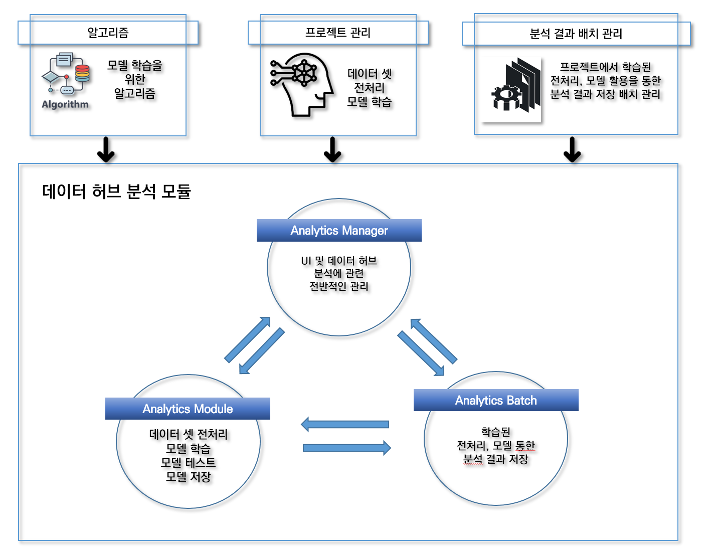
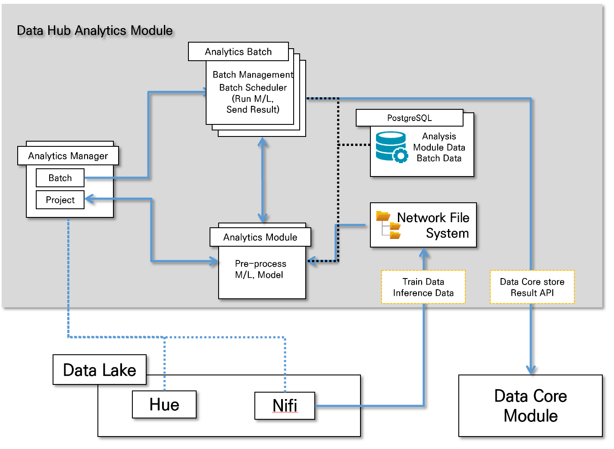

Data Hub Analytics Module
---

### 1. Data Hub Analytics Module 대한 설명
아래와 같은 방식으로 설치하는 것을 권장하지만, 서버구성은 자유롭게 변경하여 설치 및 이용 가능합니다. 

#### A. 분석관리서버
샌드박스 생성 관리, 데이터를 학습 및 분석, 배치 실행을 관리하는 웹 서버

**프로그램 리스트**

- 데이터분석시스템_분석관리서버(ANALYTICS_MANAGER)
- 데이터분석시스템_배치관리서버(ANALYTICS_BATCH_MANAGER)
- Network File Server
- POSTGRESQL

#### B. 배치분석서버
데이터 탐색 및 분석, ETL, 기계학습 등이 시행되며, 분석관리서버 내부의 배치관리서버로부터 전달받은 명령을 실제 수행하는 서버로, 분석모듈이 탑재되어 예측과 같은 배치작업을 실행하기 위해서 사용됨

**프로그램 리스트**

- RABBITMQ
- 데이터분석시스템_분석모듈
- 관리서버의 NFS에 연결
- POSTGRESQL

### 2. Data Hub Analytics Module Architecture
#### A. 모듈 개념도

#### B. 아키텍처
